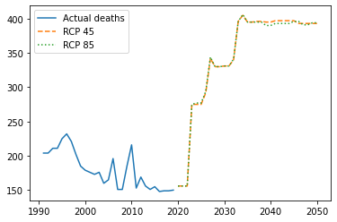
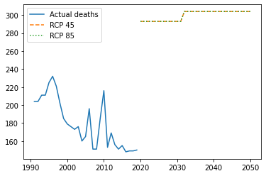

# Cheating Charon: Predicting Excess Mortality Due to Temperature Variation Globally

This repo contains the data, references, and code used to analyze the effect of temperature variations on deaths. The project is part of the assignments in the discipline "Machine Learning" at the Hertie School, and the teacher is Prof. Slava Jankin, Ph.D.

The group used data from the population (actual and projections) and temperature (real and the scenarios from RCP 4.5 and 8.5) to find a relationship between them and deaths due to excess heat or cold. 

Several models were tested and compared according to their R2, AdjR2, RMSE, and MSE. Finally, we selected Gradient Boost and XGBoost to run four predictions (2 scenarios each).

The final predictions were only considering Germany, betweeen the years 2021-2050.

Please check the Colab Notebook for more details and the R folder to better understand the data-wrangling process.

#### Projection using Gradient Boost

#### Projectiong using XGBoost

## Authors (alphabetical)

Fernando Corral Lozada - [f.corral\@students.hertie-school.org](mailto:f.corral@students.hertie-school.org)
Paul Sharratt - [p.sharratt\@students.hertie-school.org](mailto:p.sharratt@students.hertie-school.org)
Rodrigo Filippi Dornelles - [r.Dornelles\@students.hertie-school.org](mailto:r.Dornelles@students.hertie-school.org)
