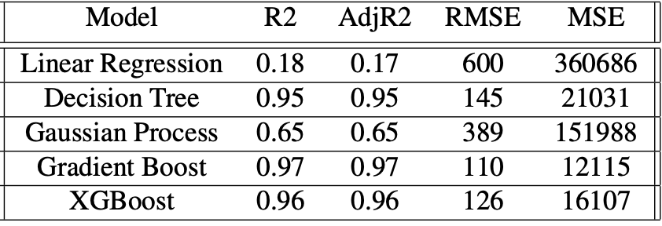
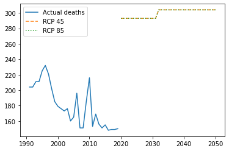
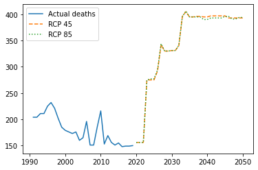

```{r setup, include=FALSE}
knitr::opts_chunk$set(echo = FALSE, 
                      code_folding = TRUE, 
                      warning = FALSE)

# Load dependencies 
library(reticulate) # For rendering Python code 

# Import data
karon <- readr::read_csv("../data/karon2.csv")
predictions <- readr::read_csv2("../data/df_outcomes.csv")
```

## Abstract

Charon, in Greek mythology, was responsible for conducting Hades' boat between the world of lives and deaths. We expected our work also to connect the world of data science and public policy. Using Charon's allegory, we want to raise the serious question of climate change and its impact on people's life.

## Introduction

In this post, we want to share one of the most exciting tasks we have had in our Master of Data Science for Public Policy at the Hertie School. Then, we will contextualize and explain why and how we decided to use a machine-learning model.

{width="693"}

Studying data science at a public policy school means looking for ways to use data to address society's challenges. Among the world's myriad problems today, climate change is perhaps the most important and existential. It will impact all countries and affect the world's economies, societies, and basic habitability. The challenges posed by climate change are not abstract but are something we all face in our day-to-day lives. The Hertie School, for instance, has sought to foreground questions of climate change through the Centre for Sustainability and the Sustainable Campus Initiative.

In 2002, the World Health Organization reported for the first time on the health impacts of climate change. This report, however, did not include predictions of excess deaths due to heat-related impacts and temperature variation because of the complexity of modeling a relationship between ambient temperature and mortality.

Machine learning approaches have matured significantly since the publication of that report, and data on the impact of man-made climate change has become more readily and freely available to the research community. As a result, machine learning is an essential tool for citizens and policymakers to better understand the impact of climate change. Using machine learning, we can simulate scenarios, estimate the influence of different factors, predict inevitable consequences, and recommend mitigation measures.

That's what we're going to do.

## The Data and the Task

The main ingredient of a data science project is... data. So, we spent considerable time thinking about which variables we'd use and where to find them.

\
For this specific task of predicting how temperature impacts mortality, we identified several reliable public data sources. We gathered a range of relevant data sets. By sourcing our data from recognized national and international institutions, such as the World Health Organization, World Bank, and the Federal Statistical Office of Germany, we could be confident in the quality of our data.

For the project as a whole, we collected data on the following:

-   Historical and predicted population data for Germany
-   Actual and predicted population in different age groups
-   Mortality rate and leading causes of death
-   Temperature forecasting in line with the IPCC high-emissions scenario Representative Concentration Pathway (RCP), also called RCP8.5.
-   Temperature forecasting in line with the low-emissions scenario also called RCP4.5. 
-   Emissions, especially CO2 and CFCs

But collecting the data is only the first step. After collecting many different tables (in many other and sometimes tricky formats), we worked with a dataset containing countries, years (from 1991 to 2050), and the temperature from each country and each year. As we had data from how many people died due to excess heat or cold until 2019, we decided that this would be our last year and, from 2020 onwards, we should make predictions.

```{r}
karon |> 
  dplyr::filter(country == "Germany") |> 
  head()
```

And, regarding predictions, we decided to project 2 scenarios: the most grave, using RCP 8.5 (estimating the most intense level of emissions, and, thus, the higher temperatures), and the less grave, using RCP 4.5. And for the population, we used the projections made by the World Bank.

So, having the data, we're ready to build the models.

## Proposed method

Before explaining the method, it may be relevant to talk a little about machine learning, in case you don't know. We'll try to explain how we used Python and a framework known as Scikit-Learn to tackle this task.

Machine learning means technics to "teach" our computers about a specific phenomenon and then make it able to predict other scenarios by giving different values. 

So, in our case, we would feed our model with the data, and the computer would produce many different simulations to find the right formula. Knowing this "secret," once changing a parameter (for instance, a new year, population, and temperature), the model would be able to give us a new (and, until then, unknown) value.

Using the train data, the computer tries to find the best parameters to an equation, simulating the best values until it best fits the test data. It tries thousands of different results until it finds the best combination. The computer can do what we would take many hours, days, or even weeks very fast (in a few seconds).

And, since it is possible (and very easy!) to try many different models, we choose several possibilities of regression models (since the objective was to predict a numeric value, not a classification). We chose linear regression (the simplest), decision tree, gradient boost, and XGBoost.

 

## Results

This process gave us different models; then, we should decide which was adequate for our task. 

So, we decided to try some metrics that could be common to all models used (as they should be used to compare them):

-   Coefficient of determination or R2 (R-squared): explains how much of the dependent variable (deaths) were explained by the predictors

-   AdjR2: similar to R2, but adjusted to the number of variables (in our case, as we had only a few, it was not that relevant)

-   RMSE (root-mean-square error): reflects the errors (meaning the difference between the results estimated and the real ones) of the model, meaning that the lower, the better

-   MSE (mean squared error): also reflects the average of the errors obtained in the model



Looking at our results, we decided to pick only the Gradient Boost and XGBoost models. Those are three-based models, where the dataset is divided by variables, and many different paths are tested several times. (Yep, it could be complicated fast, but it's also potent!).

## Analysis

Choosing those two models, we gave them the prediction data: a dataset containing the projections of population and temperature from Germany from 2020 to 2050. One version uses the temperatures of the RCP 4.5 scenario, and the other uses RCP 8.5. 

The XGBoost results looked like this:

 

And Gradient Boost is like this:

 

Although not perfect, our models showed us that, indeed, a relevant increase in the number of deaths due to climate change is expected. There is an essential positive relation between temperature rise and future deaths due to climate change.

On the other hand, our models needed to be more precise to estimate the differences in both scenarios. And, probably, the big jump in deaths in the next five years is not accurate.

It might suggest that those impacts would only be relevant in a future scenario, not in the very short term. But, also, it might indicate that even in the less grave scenario, the situation is already critical. In the end, one evitable death is already too much.

## Conclusion(s)

As an experimental model, it should not be considered automatically or acritically. However, we learned that teaching machines is a valuable tool. Moreover, state of the art in machine learning allows us to make good predictions quickly and easy. (Note: we played with the famous ChatGPT, and it could write a full script to fit an XGBoost model to us. [Check it here](https://github.com/rfdornelles/mds_ML_project/blob/main/blogpost/script_by_ChatGPT.py).).

But, naturally, the predictions, in this case, were still very simplistic. Therefore, we probably would need to consider more variables and find in the literature other valuable predictors.

But, even though our preliminary conclusions do not allow climate negationists to undermine the grave consequences of climate change only if the model is not wholly accurate in the next few years.

The most evident outcome is that Charon is thrilled with this climate chaos and will work a lot in the next few years. So let's do our best to cheat him as much as possible!

## Acknowledgments

We opened this blog post with a picture of Charon that was generated by the artificial intelligence of DALL-E 2, and intends to represent the idea of Charon, climate change and the role of machines and artificial intelligence on helping us to overcome this crisis. The original image is above, and Gustave Doré painted it for an 1861 edition of Dante's Inferno (The Divine Comedy).

Also, we gave as an example [a short Python script written by ChatGPT](https://github.com/rfdornelles/mds_ML_project/blob/main/blogpost/script_by_ChatGPT.py) artificial intelligence. It was generated by providing a short prompt explaining our intention to predict deaths using county, year, and temperature. 

Those two examples might spark some reflections about the following uses of machine learning, deep learning, and artificial intelligence to tackle urgent and complex problems.

\
